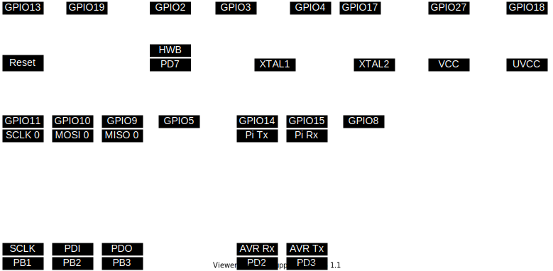

# AVR Test HAT

A Raspberry Pi HAT for testing against AVR microcontrollers.

## Circuits

Simplified connections between AVR and Raspberry Pi:

## Credits

- [Raspberry Pi HAT Template](https://workspace.circuitmaker.com/Projects/Details/jonaslorander/Raspberry-Pi-HAT-Template) by [Jonas Lorander](https://workspace.circuitmaker.com/User/Details/jonaslorander)
- [SnapEDA](https://www.snapeda.com)